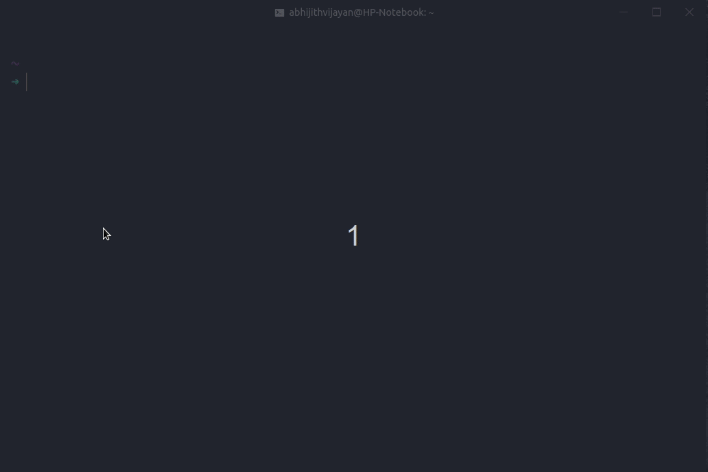

# Deprecated!
WARNING: This project has been renamed to `@abhijithvijayan/portfolio`. Install using new-package-name instead.

# abhijithvijayan-portfolio [](https://www.npmjs.com/package/abhijithvijayan-portfolio) [](https://travis-ci.com/abhijithvijayan/portfolio-cli)

> CLI to use my [portfolio](https://github.com/abhijithvijayan/abhijithvijayan.in) site as a template to build yours.

<h3>🙋‍♂️ Made by <a href="https://twitter.com/_abhijithv">@abhijithvijayan</a></h3>
<p>
  Donate:
  <a href="https://www.paypal.me/iamabhijithvijayan" target='_blank'><i><b>PayPal</b></i></a>,
  <a href="https://www.patreon.com/abhijithvijayan" target='_blank'><i><b>Patreon</b></i></a>
</p>
<p>
  <a href='https://www.buymeacoffee.com/abhijithvijayan' target='_blank'>
    
  </a>
</p>
<hr />


## Install

Ensure you have [Node.js](https://nodejs.org) 8 or later installed. Then run the following:

```
$ npm install --global abhijithvijayan-portfolio
```

If you don't want to install the CLI globally, you can use `npx` to run the CLI:

```
$ npx abhijithvijayan-portfolio --help
```

## Usage

```
$ abhijithvijayan-portfolio --help

  CLI to use my portfolio site template to build yours!

	Usage
	  $ abhijithvijayan-portfolio [input] [options]

	Input
		generate	Bootstraps the portfolio template
		serve  		Serves the portfolio template locally
		deploy    	Creates a travis config file to deploy to GitHub Pages

	Options
		-v, --version   Show the version and exit with code 0

  Examples
		$ abhijithvijayan-portfolio generate
```

## Show your support

Give a ⭐️ if this project helped you!

## License

MIT © [Abhijith Vijayan](https://abhijithvijayan.in)
